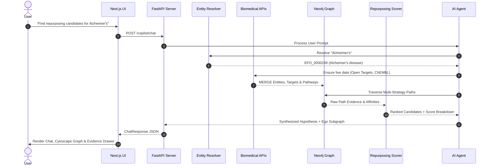

# System Architecture: Drug Repurposing Copilot 🏗️

## Overview

The Drug Repurposing Copilot is built on a modular, service-oriented architecture designed to combine the expressive power of graph databases with multi-modal biomedical evidence and autonomous AI reasoning.

---

## 1. Architectural Layers

### A. Biomedical Ingestion & Live Sync Layer
- **Async Client Pool**: Built on `httpx.AsyncClient` with connection pooling, exponential backoff (via `tenacity`), and rate limiting to respect upstream API fair-use guidelines.
- **Canonical Entity Resolution**: Normalizes messy input text, synonyms, and cross-database identifiers to canonical nodes (`Drug.canonical_id`, `Disease.canonical_id`, `Protein.uniprot_id`, `Gene.ensembl_id`, `ClinicalTrial.nct_id`, `Publication.pmid`).
- **Live Data Layer (Cache-Aside + On-Demand Sync)**: When an entity is queried, the system verifies its freshness in Neo4j (TTL: 7 days). If missing or stale, upstream APIs are queried, normalized, and merged into the graph in real time.

### B. Knowledge Graph Layer (Neo4j & In-Memory Engine)
- **Central Graph Engine**: Neo4j 5.20+ with unique constraints and performance indexes.
- **In-Memory NetworkX Engine**: Provides in-process graph querying and algorithmic computation for sub-millisecond graph traversals and standalone testing.
- **Provenance Standard**: Every relationship stores W3C PROV-DM metadata: `source`, `source_id`, `source_url`, `confidence`, `evidence_type`, and `retrieved_at`.

### C. Repurposing Engine & Scoring Layer
- **Multi-Strategy Traversals**:
  1. Direct Target Overlap (Disease $\leftarrow$ Gene $\rightarrow$ Protein $\leftarrow$ Drug)
  2. Biological Pathway Co-occurrence (Disease $\rightarrow$ Pathway $\leftarrow$ Protein $\leftarrow$ Drug)
  3. PPI 2-Hop Network Proximity
  4. Indication Pivot & Target Profile Similarity
- **Explainable Scorer**: Computes a multi-component score ($S \in [0, 1]$) with published formulas and transparent explanations.

### D. AI Copilot Agent Layer
- **Controlled Tool Registry**: Controlled tools (`find_candidate_drugs`, `get_drug`, `get_disease`, `get_target`, `find_mechanism`, `find_trials`, `search_publications`, `run_readonly_cypher`).
- **Cypher AST Security Enforcer**: Prohibits any modification keywords (`CREATE`, `MERGE`, `DELETE`, `DROP`, `SET`, `ALTER`, `CALL dbms.*`) via parameterized query execution.
- **Biomedical Synthesis Engine**: Generates evidence-backed responses with biological steps, limitation disclosures, and medical disclaimers.

### E. Frontend Application Layer
- **Next.js 14 App Router**: React 18, TypeScript, and Tailwind CSS.
- **Cytoscape.js Visualization**: Interactive graph canvas with dynamic physics layouts, node color-coding, and edge provenance inspection.
- **Responsive 3-Panel Workspace**: Side-by-side AI chat, live knowledge graph, and granular evidence drawer.

---

## 2. Data Flow Sequence

